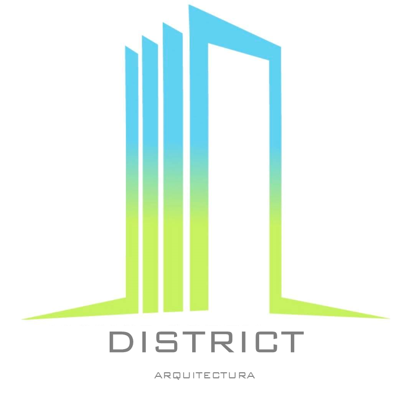

# DISTRICT Arquitectura Web Application 🏛️✨

> *"Nos dedicamos al diseño arquitectónico, y buscamos adaptar tu idea, para brindarte la mejor opción."* — **Arq. Jaime Facundo**



## 📌 Descripción General

Aplicación web interactiva de alto rendimiento desarrollada para **DISTRICT Arquitectura**. Permite a clientes explorar el portafolio de proyectos fotorrealistas 3D, calcular presupuestos dinámicos de diseño y construcción con la herramienta **"Adapta tu Idea"**, y agendar consultas directas con el **Arq. Jaime Facundo**.

---

## 🚀 Características Principales

- **Branding Institucional Oficial**:
  - Paleta de colores extraída de la marca original: Cyan (`#00C8FF`) a Lima (`#A4E033`).
  - Logotipo oficial en PNG alta resolución y versión SVG vectorial interactiva.
- **Herramienta "Adapta tu Idea"**:
  - Calculador interactivo de presupuesto según m², tipo de obra, acabado y entregables adicionales (renders 3D, cálculo estructural, permisos).
  - Generador automático de solicitudes por WhatsApp dirigidas al **419-707-9143**.
- **Portafolio Multi-Filtro con Visor 3D**:
  - Categorías: Fachadas Modernas, Renders 3D HD, Interiores & Cocinas, Albercas & Terrazas, Obra & Terrenos.
  - Modales con zoom de alta definición y lista de especificaciones técnicas.
- **Sistema de Citas & Reservaciones**:
  - Calendario y formulario de reserva asignado al **Arq. Jaime Facundo** (`jfacundo@district.com`).
- **Arquitectura Limpia & TDD**:
  - Desarrollo con React + TypeScript + Tailwind CSS + Vitest.

---

## 🛠️ Stack Tecnológico

- **Frontend**: React 18, TypeScript, Vite, Tailwind CSS.
- **Iconos & Animaciones**: Lucide React, Canvas Confetti.
- **Testing**: Vitest, React Testing Library.
- **Deploy**: Compatible con Vercel, Netlify, Cloud Run.

---

## 🧪 Pruebas Unitarias

Para ejecutar la suite de pruebas TDD con Vitest:

```bash
npm run test
```

Para realizar la compilación de producción:

```bash
npm run build
```

---

## 📞 Contacto

- **Director de Arquitectura**: Arq. Jaime Facundo
- **Teléfono / WhatsApp**: [419-707-9143](tel:4197079143)
- **Correo Electrónico**: [jfacundo@district.com](mailto:jfacundo@district.com)
- **Desarrollado por**: Arcano Solutions
